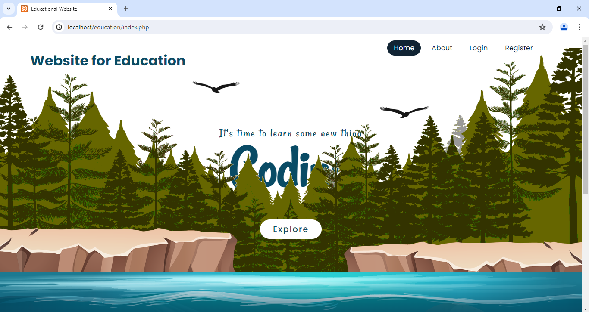
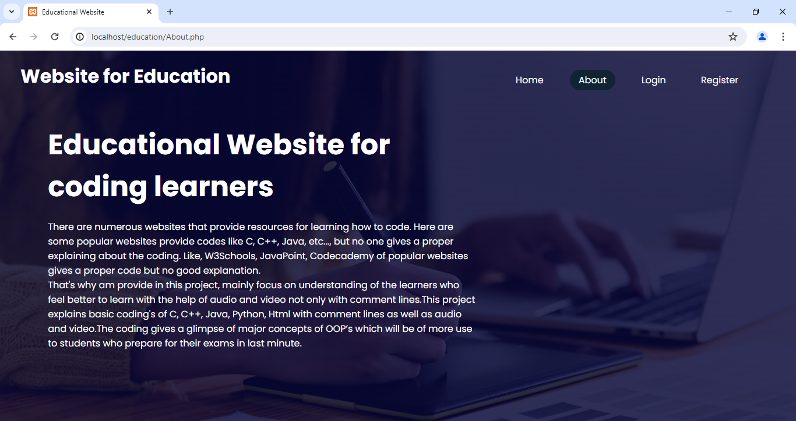
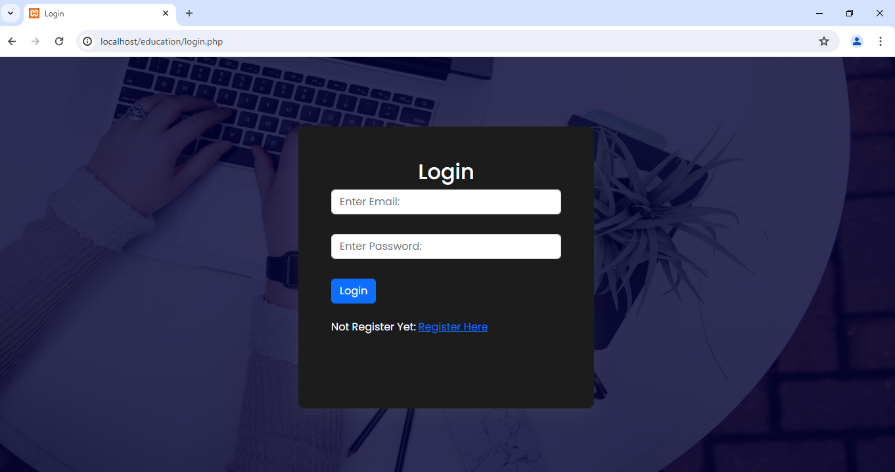
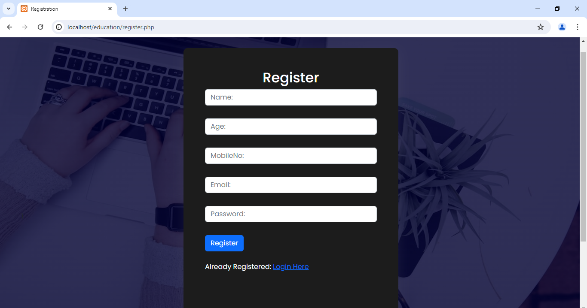

# Website for Education

Simple web project that made for education purpose.
This project helps to learn coding using audio and video to help to easy adopt the students

  1.Admin
  
    Admin can manage students and contents
    
    Schedule new sessions;
    
    View and analysis erros and correct that;
    
       

    
 
  2.Students
  
  
    View their Contents;
    
    View videos and audios;
    
    Tell the errors also or what can they want;
    
Login Page    
	

    

Sign up page

-----------------------------------------------

# HOW TO GET STARTED

Open your XAMPP Control Panel and start Apache and MySQL.

Extract the downloaded source code zip file.

Copy the extracted source code folder and paste it into the XAMPP's "htdocs" directory.

Browse the PHPMyAdmin in a browser. i.e. http://localhost/phpmyadmin

Browse the Educational website in a browser. i.e. localhost/foldername/index.php.

---------------------------------------
# The Project was developed using the following:

Apache Version: 	2.4.39

PHP Version: 		7.3.5

Server Software: 	Apache/2.4.39 (Win64) PHP/7.3.5

MySQL Version: 		5.7.26

